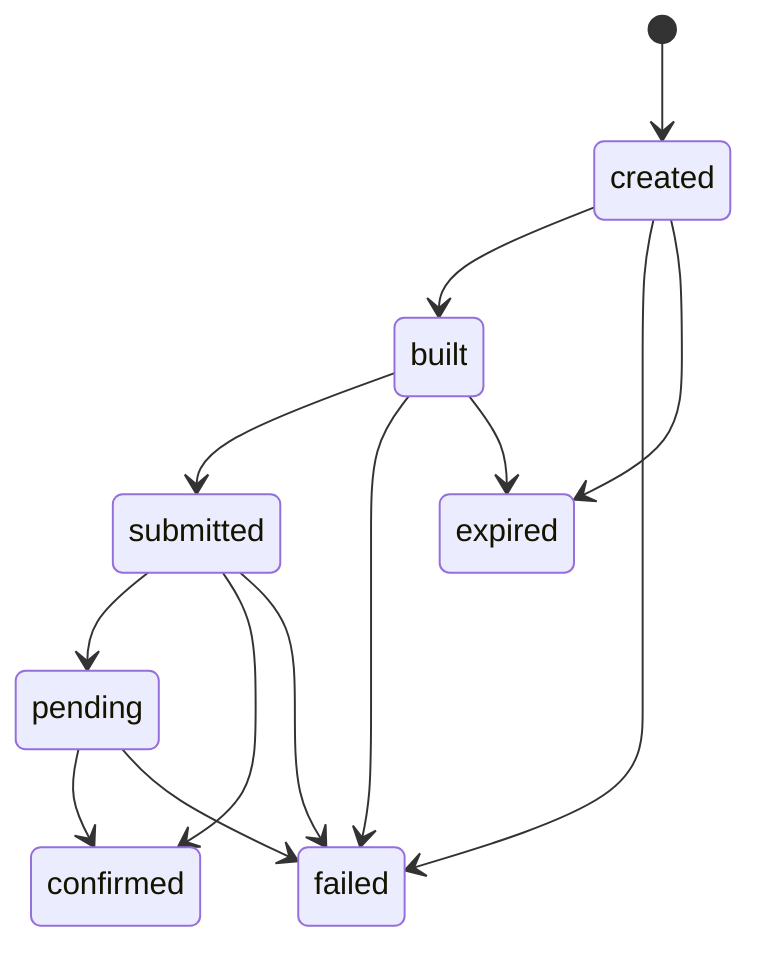
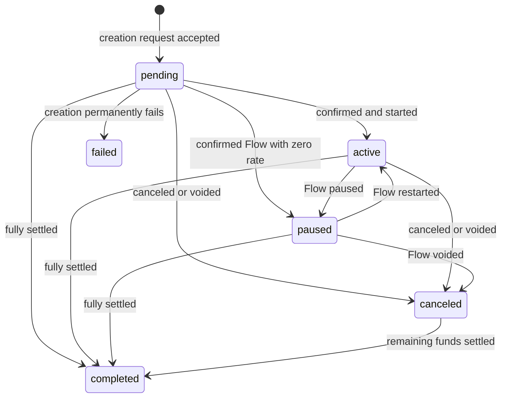

# Phase 3 Canonical Backend State Specification

Status: Ready for review  
Version: 1.0  
Last updated: 2026-09-02

## Purpose and Scope

This document defines the durable backend state required for Stellar payment
streams. It is the phase 3 implementation target for `backend-main` and the
state contract consumed by the phase 4 sponsorship API and phase 5 indexer.

The lifecycle and authority rules in
`stellar_streams_lifecycle_and_authorization.md` remain normative. This
document translates those rules into database records, state transitions,
uniqueness constraints, idempotency behavior, and restart recovery.

## Entity Boundaries

The backend must keep these concepts separate:

1. **Intent** is the authenticated action the user asked Fundable to perform.
2. **Submission** is one relayer/on-chain transaction attempt for an intent.
3. **Stream** is the canonical projection of a stream that exists on-chain.
4. **Activity** is one immutable, indexed contract event or submission outcome.

A transaction hash is a submission identifier, never a stream identifier. A
creation intent that has not established a stream on-chain has no public
`streamId`. Failed creation attempts must remain queryable by request/intent ID
and must not create a fabricated NFT token ID or core stream ID.

## Transaction and Submission State Machine (DATA-01)

Every state-changing request owns an immutable intent record and at least one
submission attempt. Use these lowercase submission states:

| State | Meaning | May transition to |
| --- | --- | --- |
| `created` | Intent accepted; no transaction has been built. | `built`, `failed`, `expired` |
| `built` | Transaction XDR and policy snapshot were built. | `submitted`, `failed`, `expired` |
| `submitted` | Submit was durably recorded before calling the relayer. The external result may be unknown. | `pending`, `confirmed`, `failed` |
| `pending` | Relayer or RPC accepted the transaction, but final chain outcome is not known. | `confirmed`, `failed` |
| `confirmed` | RPC reports a successful transaction in a ledger and its effects have been indexed. | none |
| `failed` | The attempt has a permanent relayer, RPC, simulation, policy, or on-chain failure. | none |
| `expired` | An unsubmitted built transaction or authorization passed its time bound. | none |



Rules:

- Write `submitted` in the database before the external relayer call. This is
  the recovery marker for a process crash during submission.
- `confirmed`, `failed`, and `expired` are terminal for one attempt. A retry
  creates a new attempt under the same intent; it does not reopen the old row.
- A transient timeout is not a permanent failure. Leave the attempt
  `submitted` or `pending` until reconciliation proves success or failure.
- `confirmed` requires a successful RPC transaction result and indexed effects;
  a relayer acknowledgement alone is insufficient.
- A failed mutation is recorded as failed activity and never changes the
  canonical stream lifecycle.

## Stream State Machine (DATA-02)

Persist exactly the canonical lowercase lifecycle values:

```text
pending, active, paused, canceled, completed, failed
```

The allowed transitions are:



There are two projections around creation:

- Before confirmation, the intent may expose `pending` or `failed`, but it has
  no public `streamId` and no canonical stream identity.
- A canonical stream row is established only after the Router mapping can be
  proven from `stream_created` and/or Router queries. Its initial state is
  derived from `Router.status_of(token_id)` and may be `pending`, `active`,
  `paused`, `canceled`, or `completed`.

`failed` is therefore retained for creation-request responses and history, not
as an on-chain engine state. Terminal stream records and Stream NFTs are never
deleted. `completed` cannot reopen. `canceled` can only move to `completed`.

Time alone may change a confirmed `pending` Lockup/Flow to `active`, and may
change a Lockup from engine `Streaming` to `Settled` while its canonical state
remains `active`. Periodic reconciliation must materialize time-derived public
status even when no event is emitted.

## Required Schema and Constraints

Names below describe the required meaning. The backend migration may retain
existing table names where compatibility requires it.

### Stream projection

The canonical stream projection must contain at least:

- internal database ID;
- `network` and `stream_nft_contract`;
- nullable `nft_token_id` until creation is confirmed;
- nullable `stream_kind`, `core_contract`, and `core_stream_id` until confirmed;
- original sender and current NFT owner;
- token contract, token decimals, immutable transferability, and Lockup
  cancelability where applicable;
- canonical lifecycle status plus engine status and solvency as separate fields;
- chain-derived balance, covered debt, uncovered debt, refundable amount,
  withdrawn amount, and refunded amount where applicable;
- last reconciled ledger/time and timestamps.

The public identity constraint is:

```text
UNIQUE (network, stream_nft_contract, nft_token_id)
```

and applies when `nft_token_id IS NOT NULL`. The internal engine identity is:

```text
UNIQUE (network, stream_kind, core_contract, core_stream_id)
```

and applies when `core_stream_id IS NOT NULL`.

The legacy `stream_id` field must be migrated to the NFT token ID meaning. It
must never hold a transaction hash or an unscoped core engine ID.

### Intent

An intent record must contain an opaque request ID, authenticated wallet,
network, operation kind, normalized typed arguments, idempotency key, a hash of
the normalized intent, authorization/session binding, expiry, and timestamps.
Its uniqueness constraint is:

```text
UNIQUE (authenticated_wallet, network, idempotency_key)
```

### Submission (DATA-04)

Each submission attempt must contain:

- intent ID and monotonically increasing attempt number;
- relayer identifier and relayer transaction ID;
- nullable on-chain transaction hash;
- submission status;
- typed failure code plus redacted failure reason;
- built transaction hash/XDR reference and authorization expiry;
- submitted, first-seen, confirmed, failed, created, and updated timestamps;
- confirmed ledger sequence and close time when successful.

Require `UNIQUE (intent_id, attempt_number)`, uniqueness for non-null relayer
transaction IDs within a relayer, and global uniqueness for non-null on-chain
transaction hashes within a Stellar network. The database, not a pre-insert
lookup, is the final concurrency-safe enforcement point.

### Activity and indexed event (DATA-05)

Activity is append-only. Store network, contract address, event name, ledger
sequence, ledger close time, transaction hash, event index, Soroban event ID
when supplied, decoded public/core stream identifiers, normalized payload, raw
XDR/value, ingestion timestamp, and schema version.

The canonical event identity is:

```text
UNIQUE (network, transaction_hash, event_index)
```

If the RPC provider supplies a stable event ID, also require
`UNIQUE (network, event_id)`. Replaying a ledger range must result in conflict
no-op/upsert behavior, never duplicate activity or repeat a projection change.

### Status spelling migration (DATA-03)

The only accepted activity spelling is `transferred`; compatibility code maps
legacy `transfered` input to it. Transfer is activity, not a canonical stream
lifecycle state, so neither spelling belongs in the final stream-status
constraint. Legacy stream rows with either spelling are migrated to
`completed`, matching the former statistics semantics, before the canonical
constraint is added.

Implementation evidence: `backend-main` commit `773556a` and migration
`0025_canonical-payment-stream-status.sql` performs the backfill, replaces any
pre-existing constraint idempotently, and restricts stream status to the six
canonical lifecycle values. The Drizzle snapshot chain is linear from 0022
through 0025, and the transfer compatibility regression is covered by
`payment-stream.utils.spec.ts`.

## Idempotency Contract (DATA-08)

Every state-changing endpoint requires an idempotency key.

- Normalize the typed intent deterministically, hash it, and bind the key to
  `(wallet, network, normalized_intent_hash)`.
- The first request creates the intent. A concurrent duplicate must resolve to
  the same row through the database uniqueness constraint.
- Reusing the key with identical normalized input returns the current intent,
  submission, and stream result without building or submitting again.
- Reusing the key with different input returns a conflict and performs no work.
- Retries after an ambiguous timeout reconcile the existing submission first.
  They must not submit a second transaction merely because the first response
  was lost.
- A new attempt is allowed only after the prior attempt is proven terminal and
  the operation is still safe. Creation retries must first prove that no Router
  mapping/event was established.
- Event handlers are idempotent by event identity and projection updates must
  compare ledger/event ordering so an older replay cannot overwrite newer
  state.

## Canonical and Display-Only Fields (DATA-09, DATA-10)

### Chain-derived canonical fields

For confirmed Stellar streams, these fields come only from finalized contract
events or contract queries:

- NFT token ID, stream kind, core contract, and core stream ID;
- original sender and current NFT owner;
- token contract and token decimals;
- lifecycle and engine status;
- transferability and cancelability/renunciation state;
- rate, schedule, timestamps, deposited/withdrawn/refunded amounts;
- balance, covered debt, uncovered debt, refundable and withdrawable amounts;
- transaction hash, ledger sequence, and event ordering.

Browser-supplied values may be stored as requested intent fields before
confirmation, but must be replaced or verified against chain data before they
appear as canonical stream fields.

### Display-only fields

Names, notes, avatars, labels, token symbols, fiat prices/rates, fiat totals,
formatted amounts, UI categories, and other user-authored metadata are
display-only unless independently verified. They must be stored separately or
clearly named as metadata and must never authorize an operation, select a
contract, determine ownership, derive balances, or drive lifecycle state.

## Restart and Recovery (DATA-11)

On startup and continuously in a scheduled worker:

1. Lease unresolved submissions using row-level locking so only one worker
   reconciles an attempt at a time.
2. For `submitted` or `pending` rows with an on-chain hash, query Stellar RPC.
   Mark successful results `confirmed` only after their events/effects are
   indexed; mark permanent failed results `failed`; keep not-found results
   unresolved until the configured finality/expiry window passes.
3. If only a relayer transaction ID exists, query the configured relayer, save
   any discovered on-chain hash, then continue with RPC as the authority for
   final outcome.
4. If neither ID was persisted because the process failed during the relayer
   call, use the intent/idempotency key and relayer request identity to recover
   the original attempt. Do not blindly resubmit.
5. For confirmed creation, locate the Router `stream_created` event, verify the
   mapping with Router queries, and upsert the canonical stream atomically with
   confirmation and activity records.
6. Resume event ingestion from the last fully committed ledger, replaying an
   overlap window. Event uniqueness makes the overlap safe.
7. Periodically reconcile every active, paused, canceled, and future-start
   pending stream against Router/core queries. Record discrepancies and alert;
   chain state wins over the database projection.

Use bounded retries with backoff. Poison records move to an operator-visible
dead-letter state/queue without being mislabeled as chain failure.

## Implementation Order and Exit Evidence

1. Add constants/types and transition tests for the two state machines.
2. Add the stream, intent, submission, activity, and indexer-checkpoint schema
   changes plus migration/backfill for `transfered`.
3. Add repository methods that make idempotency and state transitions atomic.
4. Update existing payment-stream reads/statistics to use canonical statuses.
5. Add restart reconciliation and event replay integration tests.
6. Record the backend commit, migration output, test results, and review in the
   mainnet-readiness checklist before closing the remaining phase 3 items.
