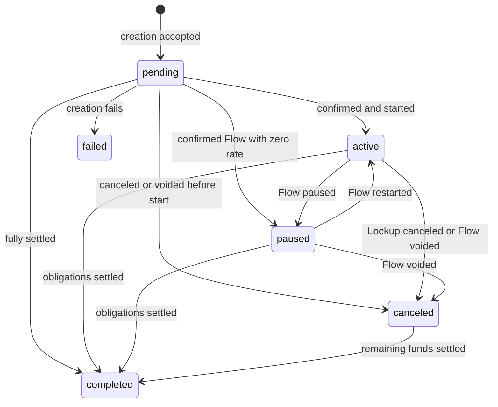

# Stellar Streams Lifecycle and Authorization Specification

Status: Approved  
Version: 1.2  
Last updated: 2026-08-23

## Purpose and Scope

This document freezes the identifiers, lifecycle vocabulary, ownership model,
and launch boundaries shared by the Fundable contracts, backend, frontend, and
indexer. It is the phase 1 architecture specification referenced by
`stellar_streams_mainnet_readiness.md`.

This specification is normative. Where an older design or implementation-plan
document conflicts with it, this specification takes precedence.

The public product model intentionally differs from some engine-specific names.
Core contracts may retain more detailed states for accounting and diagnostics,
but every external system must expose the canonical public lifecycle defined
here.

## Architecture Decisions

### ARCH-01: Production fee abstraction

OpenZeppelin Relayer's native Soroban sponsored-transaction flow is the sole
production fee-abstraction mechanism:

```text
quote -> build -> sign user authorization entry -> submit
```

The OpenZeppelin FeeForwarder is the only production contract allowed to
mediate sponsored calls. Fundable's custom Paymaster is transitional testnet
code and must not be deployed or accepted as a production transaction path.
It may be retired only after the native flow passes end-to-end testnet
qualification.

### ARCH-02 through ARCH-04: Stream identifiers

The Stream NFT token ID is the public stream ID. It is the identifier accepted
by product URLs and public backend APIs and displayed to users. It is global
across Flow and Lockup within one Stream NFT deployment.

The canonical persistence key is scoped by network and deployment:

```text
(network, stream_nft_contract, nft_token_id)
```

This prevents collisions across testnet/mainnet, redeployments, or migrations
while allowing public APIs for a configured deployment to use the token ID as
`streamId`.

Each core engine also assigns its own `u64` stream ID. That value is an internal
engine ID and is meaningful only with its stream kind and core contract:

```text
(stream_kind, core_contract, core_stream_id)
```

The Router/Stream NFT mapping between the public NFT token ID and internal
engine tuple is canonical on-chain state. Backends and indexers must derive the
mapping from contract state or events, never from browser metadata.

A transaction hash identifies a submission, not a stream. It may be associated
with zero, one, or multiple effects and must never be used as `streamId`, an NFT
token ID, or a core stream ID.

### ARCH-05: Canonical public lifecycle

All product-facing systems use exactly these lowercase lifecycle values:

| State | Meaning | Settlement behavior |
| --- | --- | --- |
| `pending` | Creation is awaiting confirmation, or a confirmed stream has a future start time. | Open |
| `active` | The confirmed stream is running or has vested value available. | Open |
| `paused` | A confirmed Flow stream is intentionally stopped but can be restarted. | Open |
| `canceled` | The sender canceled a Lockup, or an authorized party permanently voided a Flow. Remaining entitled funds may still be withdrawable. | Mutation-terminal; settlement remains open |
| `completed` | The stream's economic obligations are fully settled and no further funds are withdrawable or refundable. | Fully terminal |
| `failed` | Creation failed before a canonical on-chain stream was established. | Fully terminal |

`failed` is a submission outcome and never an on-chain engine state. A failed
mutation does not change the stream lifecycle; it is recorded as a failed
activity against the stream.

#### Engine-to-public mapping

| Engine/source state | Canonical state | Notes |
| --- | --- | --- |
| Unconfirmed creation submission | `pending` | Backend submission state. |
| Lockup `Pending` | `pending` | Start time is in the future. |
| Lockup `Streaming` | `active` | Vesting is in progress. |
| Lockup `Settled` | `active` | Fully vested, but funds remain withdrawable. |
| Lockup `Canceled` | `canceled` | Vested funds may remain withdrawable. |
| Lockup `Depleted` | `completed` | No funds remain. |
| Flow `Pending` | `pending` | Start time is in the future. |
| Flow `StreamingSolvent` | `active` | Balance covers debt. |
| Flow `StreamingInsolvent` | `active` | Health/solvency is a separate attribute. |
| Flow `PausedSolvent` | `paused` | Solvency is a separate attribute. |
| Flow `PausedInsolvent` | `paused` | Solvency is a separate attribute. |
| Flow `Voided` with funds or covered debt remaining | `canceled` | Withdrawal/refund settlement can continue. |
| Flow `Voided` with no withdrawable or refundable funds | `completed` | Fully settled. |
| Creation submission permanently failed | `failed` | No stream identity may be fabricated. |

Solvency, cancelability, transferability, and settlement amounts are orthogonal
fields. They must not be encoded as additional public lifecycle names.

#### Allowed public transitions



Terminal states cannot transition back to `pending`, `active`, or `paused`.
`canceled` can transition only to `completed` as remaining vested/covered funds
are withdrawn or refundable funds are returned.

### ARCH-06: Sender rights and NFT-owner rights

The original sender and the current Stream NFT owner are independent roles.
NFT transfer changes only the NFT-owner role. It never changes the sender stored
in the core engine.

| Operation | Original sender | Current NFT owner | Other address |
| --- | --- | --- | --- |
| Create/fund a Lockup | Yes | No role until mint | No |
| Cancel a cancellable Lockup | Yes | No | No |
| Renounce Lockup cancellation | Yes | No | No |
| Withdraw vested Lockup funds | No, unless also owner | Yes, through Router | No |
| Deposit/top up a Flow | Yes | Yes | Yes, with funder authorization |
| Pause/restart/adjust Flow rate | Yes | No | No |
| Refund unowed Flow balance | Yes | No | No |
| Withdraw covered Flow debt | No, unless also owner | Yes, through Router | No |
| Void a Flow | Yes | Yes, through Router | No |
| Transfer the Stream NFT | Only if current owner and the stream is transferable | Yes, if the immutable stream policy permits | No |

The withdrawal destination may differ from the owner, but the current owner
must authorize the Router call. This allows an owner to send a withdrawal to a
different wallet without transferring ownership.

### Flow void semantics

Either the original sender or the current NFT owner may permanently void a
Flow stream:

- The sender invokes the Flow core using the internal engine ID.
- The current NFT owner invokes a Router void function using the public NFT
  token ID. The Router verifies current ownership, resolves the core mapping,
  and invokes Flow as the core recipient.
- Voiding stops future accrual, writes off uncovered debt, and cannot be undone.
- Covered debt remains withdrawable by the current NFT owner.
- Refundable balance remains refundable by the original sender.

The NFT-owner Router path is implemented in the current Router interface.

### ARCH-07: Transferability

Each v1 stream selects an immutable `transferable` policy at Router creation.
The Router passes that policy to the Stream NFT mint, and the Stream NFT stores
and enforces it on-chain. A current owner can transfer a live or terminal NFT
only when the stored policy is `true`; a `false` policy cannot be changed or
overridden by lifecycle state.

Backend schemas and frontend creation forms must expose and submit the same
boolean. Router metadata and Stream NFT state are canonical; display-only
metadata must never be used to decide whether a transfer is allowed. Receipts
minted before this policy existed retain the former transferable behavior when
their immutable policy key is absent.

### ARCH-08: Terminal Stream NFTs

Terminal Stream NFTs persist as permanent receipts. They are not burned when a
stream becomes `canceled` or `completed`, and their token-to-engine mapping
remains queryable. Transfer remains allowed after termination only when the
stream's immutable transferability policy permits it.

The existing NFT `burn` entrypoint is not part of the normal stream lifecycle.
Before mainnet it must either be removed or constrained to an explicitly
approved migration/recovery procedure that cannot erase ordinary receipts.

### ARCH-09 and ARCH-10: Release scope

The initial mainnet product scope is Lockup only. Flow contracts and UI may be
deployed or exercised on testnet, but production creation and mutation routes
must remain disabled.

Flow has a separate release gate. It may be enabled only after phase 12 of the
mainnet readiness checklist passes, including creation, initial funding,
management, indexing, reconciliation, recovery, security review, and testnet
qualification.

### ARCH-11: Upgrade governance

Production Flow, Lockup, and Router upgrades are controlled by the approved
five-signer Governance contract. Ordinary actions require three approvals and
a 48-hour timelock. Emergency actions require four approvals, may execute
immediately, and must carry a nonzero reason/document hash. Router remains the
Stream NFT admin and routes NFT upgrades. The complete policy is recorded in
`upgrade_governance.md`.

## Cross-System Invariants

1. One public NFT token ID maps to exactly one immutable stream kind and core
   engine ID for the lifetime of a deployment.
2. A core stream created through the Router names the Router as recipient; the
   NFT owner is the beneficial recipient.
3. Only the current NFT owner can authorize a Router withdrawal or NFT-owner
   Flow void.
4. When the immutable stream policy permits transfer, NFT transfer changes
   withdrawal and NFT-owner void rights atomically, but does not change sender
   cancellation, refund, or Flow-management rights.
5. Lockup cancellation freezes vesting, returns unvested funds to the original
   sender, and preserves the current owner's right to withdraw vested funds.
6. No terminal transition burns the NFT or deletes its engine mapping.
7. Chain state and indexed contract events are canonical for identity,
   ownership, amounts, and lifecycle. User-supplied metadata is display-only.
8. A transaction hash is never promoted to stream identity.

## Known Phase 2 Alignment Work

This specification records the target architecture; it does not claim the
current contracts already enforce every decision. Phase 2 must resolve at least
these known gaps:

- Update backend and frontend call sites for the required immutable
  `transferable` creation argument and surface the canonical on-chain value.
- Complete remaining authorization-tree, invariant, resource, governance, and
  reproducible-build evidence tracked by the mainnet-readiness checklist.

## Approval Record

Phase 1 exits only when representatives for each surface record review here.
An approval means agreement with the identifiers, state names, transitions,
rights model, and release scope in this document.

The CTO approved this proposal organization-wide on 2026-08-22. This executive
approval covers the contract, backend, frontend, and indexing surfaces and is
the authority for closing the phase 1 architecture gate.

The CTO amended ARCH-07 on 2026-08-22 to require immutable per-stream
transferability enforced by the Stream NFT contract. Version 1.1 recorded that
approval and supersedes the original universal-transferability decision.

The CTO approved ARCH-11 on 2026-08-23: five signers, three approvals plus a
48-hour delay for ordinary actions, and four approvals for immediate emergency
actions with an auditable reason hash.

| Surface | Owner/reviewer | Status | Date/evidence |
| --- | --- | --- | --- |
| Contracts | CTO | Approved | 2026-08-22 — approval recorded in this Codex task |
| Backend | CTO | Approved | 2026-08-22 — approval recorded in this Codex task |
| Frontend | CTO | Approved | 2026-08-22 — approval recorded in this Codex task |
| Indexing | CTO | Approved | 2026-08-22 — approval recorded in this Codex task |
