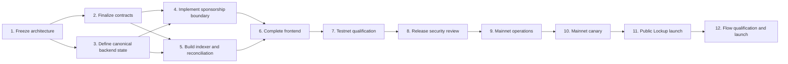

# Stellar Streams Mainnet Readiness Checklist

## Purpose

This document is the canonical cross-repository checklist for taking Fundable's
Stellar payment-stream lifecycle to mainnet. It covers:

- `fundable-soroban-contracts`
- `frontend-main-monorepo/apps/stellar`
- `backend-main`
- `openzeppelin-relayer`

Use this file as the starting context for future implementation and review
tasks. Update checkboxes only when the corresponding exit evidence exists.

## Current Recommendation

1. Use OpenZeppelin Relayer's native Soroban sponsored-transaction flow:
   `quote -> build -> sign user auth entry -> submit`.
2. Retire the custom Fundable Paymaster after the migration has passed testnet
   end-to-end testing.
3. Launch Lockup first.
4. Keep Flow disabled on mainnet until its creation, funding, management,
   indexing, and recovery paths are complete.

## Status Legend

- `[ ]` Not complete or not yet evidenced.
- `[x]` Complete and supported by linked release evidence.
- `Blocked` Cannot start because a dependency is incomplete.
- `In progress` Actively being implemented.
- `Ready for review` Implemented but not yet independently verified.

## Dependency Order

The critical path is:

> Architecture -> contract and event freeze -> sponsorship and canonical state
> -> frontend integration -> testnet qualification -> release review ->
> mainnet canary -> public Lockup -> Flow.

---

## Phase 1: Freeze the Architecture

Specification: [Stellar Streams Lifecycle and Authorization Specification](stellar_streams_lifecycle_and_authorization.md)

Status: Complete. The CTO approved the specification organization-wide on
2026-08-22, covering the contract, backend, frontend, and indexing surfaces.

### Decisions

- [x] **ARCH-01:** Record OZ native FeeForwarder as the sole production fee-abstraction mechanism.
- [x] **ARCH-02:** Define the NFT token ID as the public/global stream ID.
- [x] **ARCH-03:** Define the Flow/Lockup core stream ID as an internal engine ID.
- [x] **ARCH-04:** Never use a transaction hash as a stream ID.
- [x] **ARCH-05:** Define canonical lifecycle states and transitions:
  `pending`, `active`, `paused`, `canceled`, `completed`, and `failed`.
- [x] **ARCH-06:** Define sender rights separately from current NFT-owner rights.
- [x] **ARCH-07:** Define whether transferability is enforced per stream. Either
  enforce it on-chain or remove the option from the product.
- [x] **ARCH-08:** Decide whether terminal Stream NFTs persist. Recommendation:
  retain them as permanent receipts.
- [x] **ARCH-09:** Approve Lockup-only initial mainnet scope.
- [x] **ARCH-10:** Approve a separate release gate for Flow.

### Required Rights Model

- [x] The original sender may cancel a cancellable Lockup.
- [x] The current NFT owner may withdraw vested/covered funds.
- [x] NFT transfer moves withdrawal rights.
- [x] NFT transfer does not move the original sender's cancellation and refund rights.
- [x] The behavior of Flow voiding by the sender and NFT owner is explicitly defined.

### Exit Gate

- [x] A reviewed lifecycle and authorization specification exists.
- [x] Contract, backend, frontend, and indexing owners agree on the same state
  names, identifiers, and authority model.

---

## Phase 2: Finalize the On-Chain Interface

Phase 2 depends on Phase 1. Backend intent validation, event indexing, and final
frontend transaction code must not be frozen before these interfaces are frozen.

Status: In progress. Current implementation evidence is recorded in
[Phase 2 Contract Interface Evidence](phase_2_contract_interface_evidence.md).

### Router and Stream NFT

- [x] **CONTRACT-01:** Preserve the Router-as-underlying-recipient model.
- [x] **CONTRACT-02:** Ensure Router withdrawal authorization uses current NFT ownership.
- [x] **CONTRACT-03:** Add on-chain per-stream transferability enforcement, or remove transferability metadata/UI.
- [x] **CONTRACT-04:** Add stable queries for NFT owner, stream kind, core stream ID, and lifecycle status.
- [x] **CONTRACT-05:** Decide and implement NFT-owner Flow voiding through Router if supported.
- [x] **CONTRACT-06:** Emit events containing both NFT token ID and core stream ID.
- [x] **CONTRACT-07:** Emit sufficient creation, withdrawal, mutation, transfer,
  and terminal-state data for deterministic indexing.
- [x] **CONTRACT-08:** Use constructor-based initialization for all mainnet deployments.
- [x] **CONTRACT-09:** Protect upgrade authority with multisig control.
- [x] **CONTRACT-10:** Require a 48-hour timelock for non-emergency upgrades;
  emergency upgrades require four-of-five approval and a reason hash.

### Lockup

- [x] **LOCKUP-01:** Verify fully funded atomic creation.
- [x] **LOCKUP-02:** Verify partial and maximum vested withdrawals.
- [x] **LOCKUP-03:** Verify cancellation freezes vesting at the cancellation point.
- [x] **LOCKUP-04:** Verify unvested funds return to the sender.
- [x] **LOCKUP-05:** Verify vested funds remain withdrawable by the current NFT owner after cancellation.
- [x] **LOCKUP-06:** Verify renounce permanently disables cancellation.
- [x] **LOCKUP-07:** Verify NFT transfer before and after partial withdrawal.
- [x] **LOCKUP-08:** Verify NFT transfer before and after cancellation.

### Flow

- [ ] **FLOW-01:** Replace local-only Flow creation with an on-chain transaction.
- [x] **FLOW-02:** Add an initial funding amount.
- [x] **FLOW-03:** Prefer atomic Router creation and initial deposit.
- [x] **FLOW-04:** Implement deposit/top-up.
- [x] **FLOW-05:** Implement pause.
- [x] **FLOW-06:** Implement restart.
- [x] **FLOW-07:** Implement rate adjustment.
- [x] **FLOW-08:** Implement partial and maximum refund.
- [x] **FLOW-09:** Implement sender and, if intended, NFT-owner voiding.
- [x] **FLOW-10:** Define and expose balance, covered debt, uncovered debt,
  refundable amount, and depletion time.
- [ ] **FLOW-11:** Keep the mainnet Flow feature flag disabled until Phase 12 passes.

### Contract Verification

- [x] **VERIFY-01:** Isolate and commit the current audit fixes (`a9deef4`).
- [x] **VERIFY-02:** Run all unit tests.
- [x] **VERIFY-03:** Verify exact Soroban authorization trees for sensitive calls.
- [x] **VERIFY-04:** Add accounting invariant/property tests.
- [x] **VERIFY-05:** Add fuzz tests for amounts, timestamps, granularity, and state transitions.
- [x] **VERIFY-06:** Test failed cross-contract calls and malicious/non-standard token behavior.
- [x] **VERIFY-07:** Profile CPU, memory, ledger reads/writes, footprint, and fees for worst-case calls.
- [x] **VERIFY-08:** Produce reproducible release WASMs.
- [x] **VERIFY-09:** Record source commit, Rust toolchain, Stellar CLI,
  Soroban SDK, dependency lockfile, and SHA-256 for every WASM.

### Exit Gate

- [x] Contract interfaces and events are frozen.
- [x] Required tests pass against release-mode WASMs.
- [x] Release artifacts are reproducible from a clean checkout.

---

## Phase 3: Define Canonical Backend State

This phase can run in parallel with Phase 2, but cannot finish until the
contract state model and event schemas are frozen.

Status: Complete. The implementation target and evidence are recorded in
[Phase 3 Canonical Backend State Specification](phase_3_canonical_backend_state.md).

- [x] **DATA-01:** Define the database transaction state machine.
- [x] **DATA-02:** Define the database stream state machine.
- [x] **DATA-03:** Migrate legacy `transfered` values: normalize transfer
  activity to `transferred` and canonicalize legacy stream status to `completed`.
- [x] **DATA-04:** Add a transaction/submission table containing relayer ID,
  relayer transaction ID, on-chain hash, status, failure reason, and timestamps.
- [x] **DATA-05:** Add an idempotent activity/event table.
- [x] **DATA-06:** Add deployment-scoped uniqueness for NFT token IDs.
- [x] **DATA-07:** Add uniqueness for transaction hashes.
- [x] **DATA-08:** Define idempotency behavior for creation and mutation requests.
- [x] **DATA-09:** Mark chain-derived fields as canonical.
- [x] **DATA-10:** Treat user metadata as display-only unless independently verified.
- [x] **DATA-11:** Define status recovery after backend or relayer restarts.

### Exit Gate

- [x] The database represents every pending, confirmed, failed, and terminal transition.
- [x] No canonical balance, owner, participant, or status depends solely on browser input.

Exit evidence: `backend-main` commit `d050c0c` adds durable intent and
append-only submission-transition persistence, restart reconciliation,
chain-authoritative projection updates, and browser-write boundaries. A
relayer confirmation remains `pending`; `confirmed` is written only in the
same transaction that persists finalized chain projection/event data. Focused
tests pass (13/13), the backend build and scoped lint pass, and Drizzle reports
no schema changes after migrations `0029` and `0030`. Migrations `0026`
through `0030` were applied to the live database and verified on 2026-09-04.

---

## Phase 4: Implement the Sponsorship Boundary

Phase 4 depends on the frozen contract call shapes and the canonical backend
intent model.

### OpenZeppelin Relayer

- [x] **RELAYER-01:** Pin the production OZ Relayer version.
- [x] **RELAYER-02:** Configure testnet with `fee_payment_strategy: "user"`.
- [x] **RELAYER-03:** Configure allowed Soroban USDC contract addresses.
- [x] **RELAYER-04:** Configure strict per-token maximum fees.
- [x] **RELAYER-05:** Configure platform XLM fee limits and fee margin.
- [x] **RELAYER-06:** Configure the FeeForwarder address explicitly for every network.
- [x] **RELAYER-07:** Verify FeeForwarder source, ABI, deployment, and WASM hash.
- [x] **RELAYER-08:** Keep OZ credentials accessible only to backend services.

RELAYER-01 evidence: production is pinned to the official OpenZeppelin Relayer
`v1.6.0` release (source commit `554f15adb4a20b180a367154d7d383351bb75b5a`)
and immutable multi-architecture OCI digest
`sha256:89d7b3df96949322dacb6df25732d4d747b9612b562ba87324997c2ae2c937ae`.
The production Compose override removes the mutable local build and requires
the digest-pinned registry artifact.

RELAYER-02 evidence: the active ignored testnet configuration and the tracked
deployment template set the `fundable-stellar-relayer` policy to
`fee_payment_strategy: "user"`. Validation confirms the entry is a Stellar
testnet relayer and uses the native user-fee gas-abstraction strategy supported
by OpenZeppelin Relayer `v1.6.0`.

RELAYER-03 evidence: the active ignored testnet configuration and tracked
deployment template restrict `allowed_tokens` to Circle's Stellar testnet USDC
Soroban contract, `CBIELTK6YBZJU5UP2WWQEUCYKLPU6AUNZ2BQ4WWFEIE3USCIHMXQDAMA`.
Circle identifies its underlying testnet asset as
`USDC:GBBD47IF6LWK7P7MDEVSCWR7DPUWV3NY3DTQEVFL4NAT4AQH3ZLLFLA5`; live
contract reads returned symbol `USDC`, seven decimals, and that asset identity.
The deployed testnet Paymaster
`CD4DQI4RKCPHGNROBXS4QWNGAHMYDTJK3GEGJZWLQFAWAVO6CYPSIXMM` returned `true`
for `is_fee_token_allowed` on the same Soroban contract. Per-token maximums
are enforced separately by RELAYER-04.

RELAYER-04 evidence: the active ignored testnet configuration and tracked
deployment template set testnet USDC `max_allowed_fee` to `10,000,000` base
units, exactly `1.0000000 USDC` at the token's verified seven-decimal
precision. This is a hard ceiling on the user's signed `max_fee_amount`, not a
fixed charge. For the OZ policy, it supersedes the stale `50,000` (`0.005
USDC`) prototype example, which is below the conservative worst-case
routed-creation fee profile at the 2026-09-04 reference price of
`$0.1798/XLM`. At that reference price, the `1 USDC` cap provides approximately
3x headroom over the profile's `1.790825 XLM` estimate; it must be revisited if
live fee telemetry or XLM/USDC pricing approaches the ceiling. The
configuration check verifies that `10,000,000` is accepted and `10,000,001` is
rejected; OpenZeppelin Relayer `v1.6.0` applies the same inclusive `fee <=
max_allowed_fee` boundary before fee conversion and submission.

RELAYER-05 evidence: the active ignored testnet configuration and tracked
deployment template set the platform `max_fee` to `30,000,000` stroops (`3
XLM`) and `fee_margin_percentage` to `10.0`. OpenZeppelin Relayer `v1.6.0`
applies that margin to the simulated XLM fee before enforcing `max_fee` and
converting the charge to USDC. The conservative `17,908,250`-stroop
routed-creation profile becomes `19,699,075` stroops after margin and remains
below the cap with approximately 52% headroom. Configuration checks verify the
profile calculation and the inclusive ceiling: `30,000,000` is accepted and
`30,000,001` is rejected. Live RPC simulation remains authoritative, and the
cap must be revisited if production telemetry approaches it.

RELAYER-06 evidence: the testnet Compose overlay explicitly sets
`STELLAR_TESTNET_FEE_FORWARDER_ADDRESS` to the verified contract
`CDJM3SROZG3TY3URXSFH7J5GEIVFHZZKWX5DVJISED6YBIONA76WBU7D`. The separate
mainnet overlay has no default and fails Compose interpolation unless
`STELLAR_MAINNET_FEE_FORWARDER_ADDRESS` is supplied. This removes reliance on
OZ defaults while leaving selection of the verified mainnet deployment to
DEPLOY-05.

RELAYER-07 evidence: the testnet contract was built with a locked dependency
graph from the official OpenZeppelin Stellar Contracts `v0.7.1` tag, commit
`3f81125bed3114cc93f5fca6d13240082050269a`, using the permissionless
FeeForwarder example. Its `forward` ABI matches the argument order hard-coded
by OZ Relayer `v1.6.0`. The contract was created in transaction
`baf15fc4fe87ae5dc12e1389baf404505d8428ccf67d3496c6bcb471b9bc50d2`.
Fetching the deployed WASM from testnet RPC produced a byte-for-byte match to
the local build: both have SHA-256
`c0292b4a994c0c94280a5a1783d907ae54b52f5e34e74bb7d5d65645ca7508fa`.
The tracked deployment manifest records the full source, ABI, artifact, and
transaction identity. The legacy Fundable Paymaster was rejected for this use
because its `forward` argument order is incompatible with OZ Relayer.

RELAYER-08 evidence: the production Compose override publishes the relayer API
on loopback by default, disables Swagger and metrics, and permits a non-loopback
bind only through the explicit `RELAYER_BIND_ADDRESS` deployment setting. The
runbook requires a private service address plus backend-only network policy,
keeps relayer and signer secrets in the deployment secret manager, and forbids
placing them in frontend/public environment variables, browser storage, logs,
or client responses. Repository inspection found `OZ_RELAYER_API_KEY` consumed
only by the backend relayer service; the frontend contains only the non-secret
public signing address.

### Backend API

- [x] **SPONSOR-01:** Implement a typed `quote` endpoint.
- [x] **SPONSOR-02:** Implement a typed `build` endpoint.
- [x] **SPONSOR-03:** Implement a typed `submit` endpoint accepting the built
  transaction XDR and the user's signed authorization entry.
- [x] **SPONSOR-04:** Implement typed intents for create, withdraw, cancel, and later Flow mutations.
- [x] **SPONSOR-05:** Stop accepting browser-assembled final Paymaster transactions.
- [x] **SPONSOR-06:** Disable the publicly reachable generic unsigned-XDR relay path.

SPONSOR-01 evidence: `backend-main` commit `3770147` adds the authenticated
`POST /api/payment-streams/sponsor/quote` endpoint with a validated request DTO
for the unsigned Soroban transaction XDR and network. The backend selects the
network-specific configured fee token rather than accepting one from the
browser, calls OpenZeppelin Relayer's sponsored quote API, and returns a stable
typed fee response. It fails closed when the relayer or network fee token is
not configured and rejects unsuccessful or malformed relayer responses. The
focused payment-stream tests pass (18/18), scoped lint and diff checks pass, and
the backend TypeScript build succeeds.

SPONSOR-02 evidence: `backend-main` commit `f1add69` adds the authenticated
`POST /api/payment-streams/sponsor/build` endpoint. Its validated request type
accepts the unsigned Soroban transaction XDR and network, while the backend
selects the configured fee token and calls OpenZeppelin Relayer's sponsored
build API. The stable response exposes the built transaction XDR, Soroban user
authorization entry, fee amounts, and authorization validity bound. The
backend rejects missing authorization entries, missing Soroban maximum fees,
fee-token mismatches, malformed/unsuccessful responses, unconfigured networks,
and relayer failures. The focused payment-stream tests pass (23/23), scoped
lint and diff checks pass, and the backend TypeScript build succeeds.

SPONSOR-03 through SPONSOR-06 evidence: `backend-main` commits `5e7ad90` and
`e640c29` replace both legacy relay endpoints with the authenticated
`POST /api/payment-streams/sponsor/submit` endpoint. Its validated request
requires the relayer-built transaction XDR, the wallet-signed Soroban
authorization entry, the network, the authorization validity bound, and a
discriminated typed intent. The intent union covers Lockup and Flow creation,
withdraw/withdraw-max, Lockup cancellation, and Flow deposit, pause, restart,
rate adjustment, refund/refund-max, and void operations. Submission binds the
intent actor to the authenticated wallet, persists the intent and authorization
expiry before calling the relayer, and forwards `signed_auth_entry` through the
pinned OpenZeppelin Stellar submit API. The browser-assembled `relayed` route,
the generic `relayed/transaction` route, their DTOs, and obsolete Paymaster-era
submission helpers are removed. Focused payment-stream tests pass (31/31),
including rejection of generic and incomplete intents; scoped lint, formatting,
and diff checks pass; and the backend TypeScript build succeeds.

### Mandatory Intent Validation

- [x] **VALIDATE-01:** Require the expected network.
- [ ] **VALIDATE-02:** Require the configured relayer source address.
- [ ] **VALIDATE-03:** Require the configured FeeForwarder contract.
- [ ] **VALIDATE-04:** Require the configured Soroban USDC fee token.
- [ ] **VALIDATE-05:** Require the configured relayer as fee recipient.
- [ ] **VALIDATE-06:** Enforce positive fee and platform/user maximums.
- [ ] **VALIDATE-07:** Require exactly one Soroban operation.
- [ ] **VALIDATE-08:** Allowlist target contract addresses.
- [ ] **VALIDATE-09:** Allowlist functions per target contract.
- [ ] **VALIDATE-10:** Verify sender/caller equals the authenticated wallet where required.
- [ ] **VALIDATE-11:** Verify recipient, amount, duration, stream ID, and function
  arguments match the typed intent.
- [ ] **VALIDATE-12:** Reject expired authorization.
- [ ] **VALIDATE-13:** Reject replayed/idempotently completed requests.
- [ ] **VALIDATE-14:** Reject unexpected sub-invocations or authorization trees.

VALIDATE-01 evidence: `backend-main` commit `b228d02` introduces the
backend-owned `STELLAR_SPONSORSHIP_NETWORK` deployment setting. Production
startup fails when it is absent or invalid; non-production environments default
to `TESTNET`. Quote, build, and submit all reject a request whose network differs
from that setting before invoking OpenZeppelin Relayer, using the stable
`SPONSORSHIP_NETWORK_MISMATCH` domain error. Focused payment-stream tests pass
(34/34), including a no-relayer-call mismatch case for every sponsorship stage;
scoped formatting, lint, and diff checks pass; and the backend TypeScript build
succeeds.

### Authentication and Abuse Controls

- [ ] **AUTH-01:** Replace address-header-only authentication with signed wallet challenges.
- [ ] **AUTH-02:** Use short-lived sessions bound to address, chain, and network.
- [ ] **AUTH-03:** Bind each signed intent to the authenticated wallet and session.
- [ ] **AUTH-04:** Add per-wallet and per-IP rate limits.
- [ ] **AUTH-05:** Add per-transaction and daily sponsorship budgets.
- [ ] **AUTH-06:** Add idempotency keys to all state-changing endpoints.

### Exit Gate

- [ ] A browser cannot cause the relayer to sign anything except an authenticated,
  policy-approved Fundable operation.
- [ ] The OZ native quote/build/sign/submit path passes testnet integration tests.

---

## Phase 5: Build Indexing and Reconciliation

Phase 5 depends on frozen contract events and the canonical backend state model.
It can run in parallel with Phase 4.

- [ ] **INDEX-01:** Index Router events.
- [ ] **INDEX-02:** Index Flow events.
- [ ] **INDEX-03:** Index Lockup events.
- [ ] **INDEX-04:** Index Stream NFT events.
- [ ] **INDEX-05:** Index relevant FeeForwarder events.
- [ ] **INDEX-06:** Persist the last successfully processed ledger.
- [ ] **INDEX-07:** Make ingestion idempotent by event identity.
- [ ] **INDEX-08:** Map NFT token IDs to core stream IDs.
- [ ] **INDEX-09:** Update canonical ownership after NFT transfers.
- [ ] **INDEX-10:** Derive canonical lifecycle state from chain state and events.
- [ ] **INDEX-11:** Handle ledger gaps and replay.
- [ ] **INDEX-12:** Add RPC failover.
- [ ] **INDEX-13:** Add periodic reconciliation of active streams.
- [ ] **INDEX-14:** Alert when database and on-chain state disagree.
- [ ] **INDEX-15:** Implement `GET /payment-streams/:streamId` with structured data.
- [ ] **INDEX-16:** Implement persistent stream activity retrieval.
- [ ] **INDEX-17:** Recover pending submissions after service restart.
- [ ] **INDEX-18:** Derive dashboard statistics from reconciled state.

### Exit Gate

- [ ] Clearing browser storage does not lose stream identity, activity, ownership,
  or lifecycle state.
- [ ] A fresh device can load a stream by its NFT token ID.
- [ ] The indexer can replay from a checkpoint without duplicating state.

---

## Phase 6: Complete the Frontend

Phase 6 depends on Phases 4 and 5.

- [ ] **UI-01:** Add verified mainnet contract addresses.
- [ ] **UI-02:** Add mainnet backend, RPC, network-passphrase, and explorer configuration.
- [ ] **UI-03:** Implement quote -> build -> sign auth entry -> submit.
- [ ] **UI-04:** Display fee token, estimated fee, maximum fee, expiration, and requested action.
- [ ] **UI-05:** Rebuild expired authorizations.
- [ ] **UI-06:** Remove custom browser-side Paymaster assembly.
- [ ] **UI-07:** Replace local Flow creation with the real flow or disable it.
- [ ] **UI-08:** Use confirmed NFT token IDs only.
- [ ] **UI-09:** Remove transaction-hash-as-stream-ID fallback.
- [ ] **UI-10:** Load stream details and activity from backend/indexed state.
- [ ] **UI-11:** Determine withdrawal permission from current on-chain NFT ownership.
- [ ] **UI-12:** Determine cancellation permission from original sender and chain state.
- [ ] **UI-13:** Refresh list, detail, activity, stats, and ownership after confirmed mutations.
- [ ] **UI-14:** Represent pending, failed, active, canceled, paused, and completed states.
- [ ] **UI-15:** Read Lockup cancellation from `status_of` or reconciled canonical state.
- [ ] **UI-16:** Expose NFT transfer only when on-chain transferability permits it.
- [ ] **UI-17:** Add independent feature flags for Lockup creation, Flow creation,
  withdrawals, cancellation, and sponsorship.

### Exit Gate

- [ ] The full Lockup lifecycle works after refresh, logout, direct-link navigation,
  and use from another device.
- [ ] No canonical lifecycle state depends on local browser storage.

---

## Phase 7: Testnet Qualification

Formal qualification begins only after the relevant interfaces are frozen.

### Actor Matrix

Test every relevant operation as:

- [ ] Original sender.
- [ ] Original recipient.
- [ ] Current NFT owner after transfer.
- [ ] Former NFT owner.
- [ ] Relayer.
- [ ] Unrelated attacker account.

### Lifecycle Tests

- [ ] **E2E-01:** Create a Lockup.
- [ ] **E2E-02:** Withdraw partially.
- [ ] **E2E-03:** Withdraw maximum.
- [ ] **E2E-04:** Cancel before start.
- [ ] **E2E-05:** Cancel during vesting.
- [ ] **E2E-06:** Cancel near completion.
- [ ] **E2E-07:** Withdraw vested balance after cancellation.
- [ ] **E2E-08:** Transfer NFT before withdrawal.
- [ ] **E2E-09:** Transfer NFT after partial withdrawal.
- [ ] **E2E-10:** Reject withdrawal by a former NFT owner.
- [ ] **E2E-11:** Reject cancellation by an NFT owner who is not the sender.

### Adversarial Sponsorship Tests

- [ ] **NEG-01:** Reject altered recipient.
- [ ] **NEG-02:** Reject altered amount or duration.
- [ ] **NEG-03:** Reject altered target contract or function.
- [ ] **NEG-04:** Reject wrong FeeForwarder.
- [ ] **NEG-05:** Reject wrong fee token.
- [ ] **NEG-06:** Reject wrong fee recipient.
- [ ] **NEG-07:** Reject zero, negative, and excessive fees.
- [ ] **NEG-08:** Reject expired authorization.
- [ ] **NEG-09:** Reject replayed authorization.
- [ ] **NEG-10:** Reject additional operations.
- [ ] **NEG-11:** Reject unexpected authorization-tree changes.

### Reliability Tests

- [ ] **RELIABILITY-01:** Concurrent submissions use safe relayer sequencing.
- [ ] **RELIABILITY-02:** Backend restart recovers pending transactions.
- [ ] **RELIABILITY-03:** Relayer restart recovers or fails transactions deterministically.
- [ ] **RELIABILITY-04:** RPC timeout after successful submission does not cause duplicate execution.
- [ ] **RELIABILITY-05:** Indexer replay does not duplicate activities.
- [ ] **RELIABILITY-06:** RPC provider failover works.
- [ ] **RELIABILITY-07:** Sustained testnet soak completes within defined error and latency budgets.

### Exit Gate

- [ ] All required tests pass against the same revisions and WASMs proposed for mainnet.
- [ ] Test evidence, transaction hashes, logs, and artifact hashes are retained.

---

## Phase 8: Release Security Review

This review applies to the frozen release candidate, not a moving branch.

- [ ] **SECURITY-01:** Freeze repository revisions and dependency locks.
- [ ] **SECURITY-02:** Rebuild and verify every WASM hash.
- [ ] **SECURITY-03:** Re-review contract authorization and accounting.
- [ ] **SECURITY-04:** Re-review backend XDR, auth-entry, and intent validation.
- [ ] **SECURITY-05:** Re-review OZ Relayer configuration and API exposure.
- [ ] **SECURITY-06:** Revalidate all earlier critical and high findings.
- [ ] **SECURITY-07:** Resolve all critical and high findings.
- [ ] **SECURITY-08:** Record disposition and compensating controls for every medium and low finding.
- [ ] **SECURITY-09:** Obtain independent review of the exact release artifacts.
- [ ] **SECURITY-10:** Create a signed release manifest containing commits,
  configurations, contract IDs, WASM hashes, and accepted residual risk.

### Exit Gate

- [ ] No unresolved critical or high findings.
- [ ] Medium and low findings have recorded owners and dispositions.
- [ ] Review evidence corresponds to the exact release artifacts.

---

## Phase 9: Prepare Mainnet Operations

Infrastructure preparation may start earlier, but production credentials and
final configuration should be bound to the reviewed release.

- [ ] **OPS-01:** Store the relayer signer in KMS/HSM.
- [ ] **OPS-02:** Use separate deployment-admin and relayer keys.
- [ ] **OPS-03:** Configure the deployment/upgrade multisig.
- [ ] **OPS-04:** Configure redundant mainnet RPC providers.
- [ ] **OPS-05:** Fund the relayer with a deliberately limited initial XLM balance.
- [ ] **OPS-06:** Configure per-wallet, per-IP, per-transaction, and daily sponsorship limits.
- [ ] **OPS-07:** Monitor relayer XLM balance.
- [ ] **OPS-08:** Monitor USDC fees collected and fee-to-cost ratio.
- [ ] **OPS-09:** Monitor pending transaction age and failure rate.
- [ ] **OPS-10:** Monitor simulation and authorization failures.
- [ ] **OPS-11:** Monitor unexpected targets and functions.
- [ ] **OPS-12:** Monitor indexer lag and reconciliation mismatches.
- [ ] **OPS-13:** Add emergency controls to pause sponsorship and stream creation.
- [ ] **OPS-14:** Document key compromise, stuck sequence, RPC outage, bad upgrade,
  indexing lag, and fee-market incident runbooks.
- [ ] **OPS-15:** Verify database, relayer-state, and indexer-checkpoint backups.
- [ ] **OPS-16:** Exercise restoration and emergency pause procedures.

### Exit Gate

- [ ] Operators can detect, contain, pause, recover, and reconcile a failure
  without deploying unreviewed code.

---

## Phase 10: Mainnet Deployment and Canary

- [ ] **DEPLOY-01:** Deploy the verified release WASMs.
- [ ] **DEPLOY-02:** Configure Router exactly once.
- [ ] **DEPLOY-03:** Verify Stream NFT administration is assigned to Router.
- [ ] **DEPLOY-04:** Verify every contract ID, admin, upgrade authority, and WASM hash on-chain.
- [ ] **DEPLOY-05:** Configure the mainnet FeeForwarder explicitly.
- [ ] **DEPLOY-06:** Configure the mainnet relayer with low initial limits.
- [ ] **DEPLOY-07:** Start the indexer and verify synchronization.
- [ ] **DEPLOY-08:** Deploy backend with public creation disabled.
- [ ] **DEPLOY-09:** Deploy frontend with public creation disabled.
- [ ] **DEPLOY-10:** Run read-only production smoke tests.
- [ ] **CANARY-01:** Enable one allowlisted internal canary wallet.
- [ ] **CANARY-02:** Create a minimum-value mainnet USDC Lockup.
- [ ] **CANARY-03:** Perform partial withdrawal.
- [ ] **CANARY-04:** Perform cancellation.
- [ ] **CANARY-05:** Withdraw the remaining vested balance.
- [ ] **CANARY-06:** Reconcile wallet balances, contract state, events,
  database records, activities, and UI state.
- [ ] **CANARY-07:** Exercise the emergency pause in production configuration.

### Exit Gate

- [ ] Canary actions succeed.
- [ ] All observability and reconciliation systems agree.
- [ ] Emergency controls work.

---

## Phase 11: Public Lockup Launch

- [ ] **LAUNCH-01:** Enable Lockup for a limited external cohort.
- [ ] **LAUNCH-02:** Keep conservative per-transaction and daily sponsorship limits.
- [ ] **LAUNCH-03:** Complete the defined stabilization period.
- [ ] **LAUNCH-04:** Review incidents, failures, support cases, and reconciliation results.
- [ ] **LAUNCH-05:** Raise limits gradually.
- [ ] **LAUNCH-06:** Enable general Lockup access.
- [ ] **LAUNCH-07:** Keep Flow disabled.

---

## Phase 12: Flow Qualification and Launch

Flow requires its own release cycle after Lockup is stable.

- [ ] **FLOW-RELEASE-01:** Complete all Phase 2 Flow requirements.
- [ ] **FLOW-RELEASE-02:** Complete Flow backend intents and validation.
- [ ] **FLOW-RELEASE-03:** Complete Flow indexing and reconciliation.
- [ ] **FLOW-RELEASE-04:** Complete Flow frontend lifecycle management.
- [ ] **FLOW-RELEASE-05:** Repeat the actor and adversarial test matrix for Flow.
- [ ] **FLOW-RELEASE-06:** Repeat release security review for the changed artifacts.
- [ ] **FLOW-RELEASE-07:** Run a low-value mainnet Flow canary.
- [ ] **FLOW-RELEASE-08:** Enable Flow independently after its exit gate passes.

---

## Final Go/No-Go Gate

Mainnet public access must remain disabled unless every applicable item below is true.

- [ ] No unresolved critical or high security findings.
- [ ] Every medium and low finding has an owner and recorded disposition.
- [ ] The exact release WASMs are reproducible and independently reviewed.
- [ ] Public generic arbitrary-XDR sponsorship is disabled.
- [ ] Wallet authentication is cryptographic.
- [ ] Backend intent validation is fail-closed.
- [ ] Backend and on-chain state reconcile automatically.
- [ ] Lockup create, withdraw, cancel, transfer, and recovery tests pass.
- [ ] Relayer sequence and restart recovery tests pass.
- [ ] Monitoring, limits, pause controls, backups, and runbooks have been exercised.
- [ ] The mainnet canary passes.
- [ ] Flow is either fully qualified or visibly disabled.

## Evidence Register

Add one row whenever an item is checked. Link to immutable commits, CI runs,
audit reports, transaction hashes, deployment manifests, or runbook exercises.

| Checklist ID | Evidence | Revision / Hash | Owner | Date | Notes |
| --- | --- | --- | --- | --- | --- |
| Example: VERIFY-02 | CI run URL | commit SHA | Team/person | YYYY-MM-DD | All contract tests passed |
| RELAYER-06 | Network-specific Compose overlays | `fee-forwarder.testnet.json` | Fundable | 2026-09-05 | Testnet pinned; mainnet fails closed until DEPLOY-05 supplies its verified address |
| RELAYER-07 | Source/build/deployment manifest and on-chain byte comparison | `c0292b4a994c0c94280a5a1783d907ae54b52f5e34e74bb7d5d65645ca7508fa` | Fundable | 2026-09-05 | RPC-fetched WASM exactly matches locked source build |
| RELAYER-08 | Production Compose boundary and credential runbook | `ops/openzeppelin-relayer/docker-compose.production.yaml` | Fundable | 2026-09-05 | Loopback default; secrets restricted to relayer/backend runtimes |
| SPONSOR-01 | Typed backend sponsorship quote endpoint and regression tests | `backend-main` commit `3770147` | Fundable | 2026-09-05 | Backend-owned fee token; fail-closed configuration and response validation |
| SPONSOR-02 | Typed backend sponsorship build endpoint and regression tests | `backend-main` commit `f1add69` | Fundable | 2026-09-05 | Requires Soroban auth entry and maximum fee fields; rejects fee-token mismatch |

## Release Identity

Complete this section for every release candidate.

| Component | Repository revision | Artifact / deployment identity |
| --- | --- | --- |
| Soroban contracts | TBD | WASM hashes and contract IDs TBD |
| Stellar frontend | TBD | Build/deployment ID TBD |
| Backend | TBD | Build/deployment ID TBD |
| OpenZeppelin Relayer | TBD | Version, image digest, and config hash TBD |
| FeeForwarder | OpenZeppelin Stellar Contracts `v0.7.1` / `3f81125bed3114cc93f5fca6d13240082050269a` | Testnet `CDJM3SROZG3TY3URXSFH7J5GEIVFHZZKWX5DVJISED6YBIONA76WBU7D`; SHA-256 `c0292b4a994c0c94280a5a1783d907ae54b52f5e34e74bb7d5d65645ca7508fa` |

## Future-Task Handoff

When starting a new Codex task, use this instruction:

> Read `docs/stellar_streams_mainnet_readiness.md` completely, identify the
> earliest incomplete phase whose dependencies are satisfied, and work only on
> the explicitly requested checklist IDs. Preserve existing user changes and
> attach verification evidence before marking an item complete.
